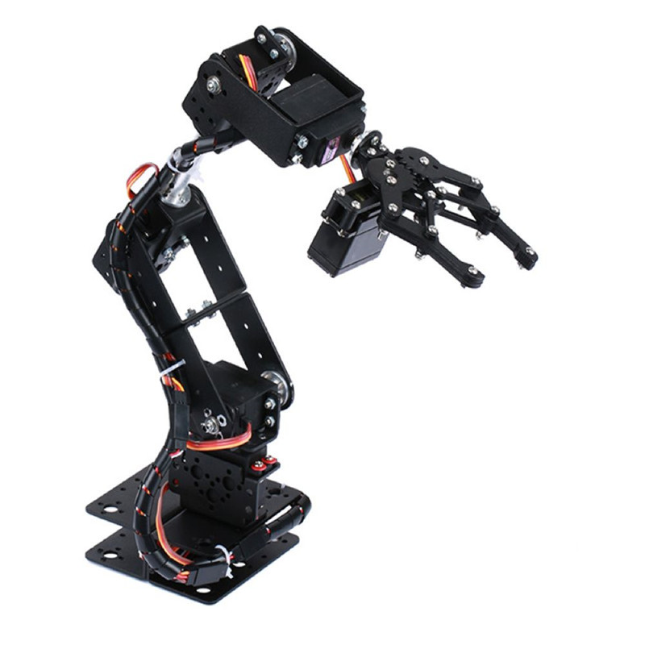
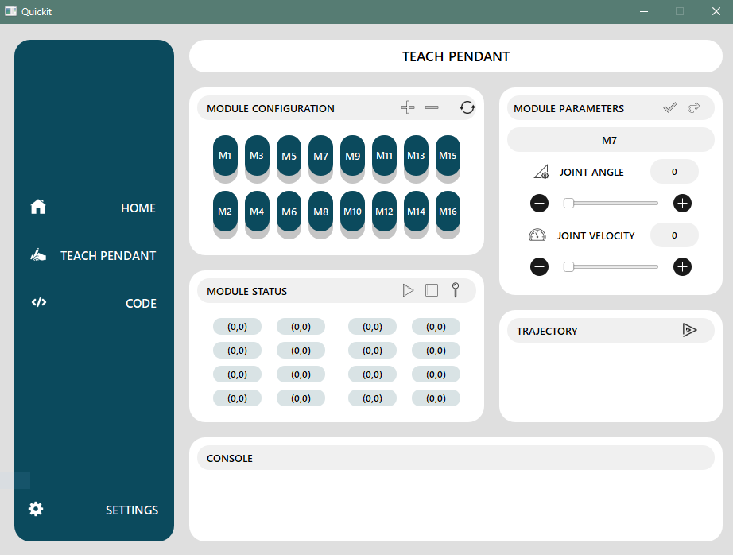

# Quickit

Welcome to the realm of robotics exploration with our Robotics Arm Kit designed specifically for beginners. This user-friendly kit provides an accessible entry point into the captivating world of robotics, offering a hands-on experience that combines educational value with practical application. With easy assembly and intuitive controls, this kit serves as an ideal introduction for enthusiasts eager to embark on their robotics journey. Dive into the fundamentals of automation and control, as this kit empowers beginners to understand the core concepts while fostering a foundation for future innovation. Join us in this transformative adventure, where learning meets excitement in the dynamic landscape of robotics for beginners.To get things started, user needs following parts:

- 6 DOF Robotics Kit : Available on [Amazon](https://www.amazon.com/Aluminium-Mechanical-Robotic-Without-Arduino/dp/B092C9RJS3/ref=sr_1_1?crid=VHWTDITOEKZP&keywords=6+dof+robotic+arm&qid=1703581006&sprefix=6+dof+%2Caps%2C385&sr=8-1),[Nonagon Solutions](https://nonagonsol.com/)
- Interface: Available on [Nonagon Solutions](https://nonagonsol.com/)
- SDK File (to control robot from PC in real time.) : Available on [Nonagon Solutions](https://nonagonsol.com/)

## About the repo:
This repository provides an open-source template to the frontend design of its SDK file which is left open-ended for the user to add features as he/she pleases.This file is created on QT framework of python and is supposed to communicate with the Interface to control the robotic arm. To work on it, you need to have basic understanding of pyserial and PyQt5.
You can look for useful resouces here:

- For PyQT5 : [Click Here](https://www.tutorialspoint.com/pyqt5/index.htm#:~:text=PyQt5%20is%20the%20latest%20version,language%20and%20the%20Qt%20library.)
- Pyserail : [Click Here](https://pyserial.readthedocs.io/en/latest/)

## How to Setup environment:
1. Clone this repo.
2. run this command in terminal --> "pip install -r requirements.txt".
3. Just run the file "__init__.py" for preview.
4. You can add features in this file.

&nbsp;   
